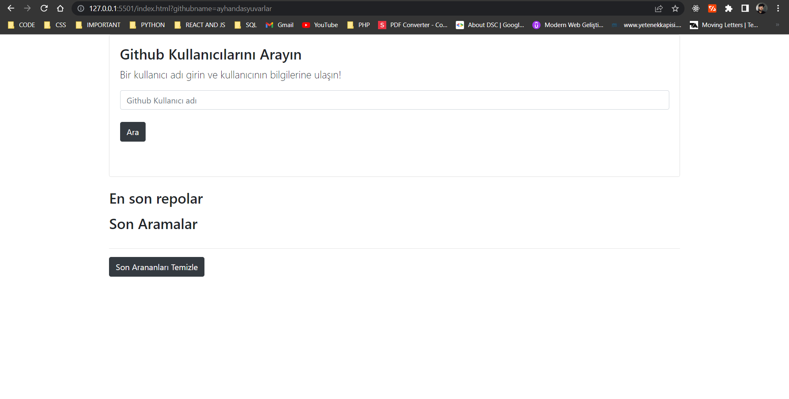
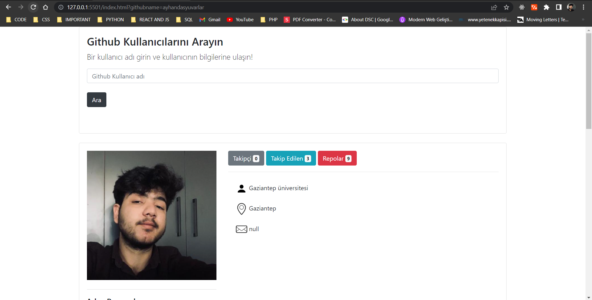
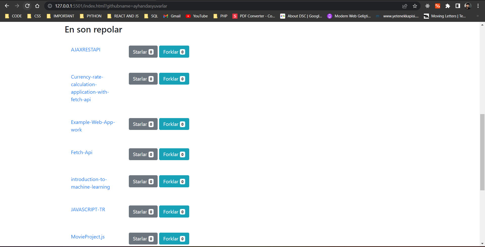
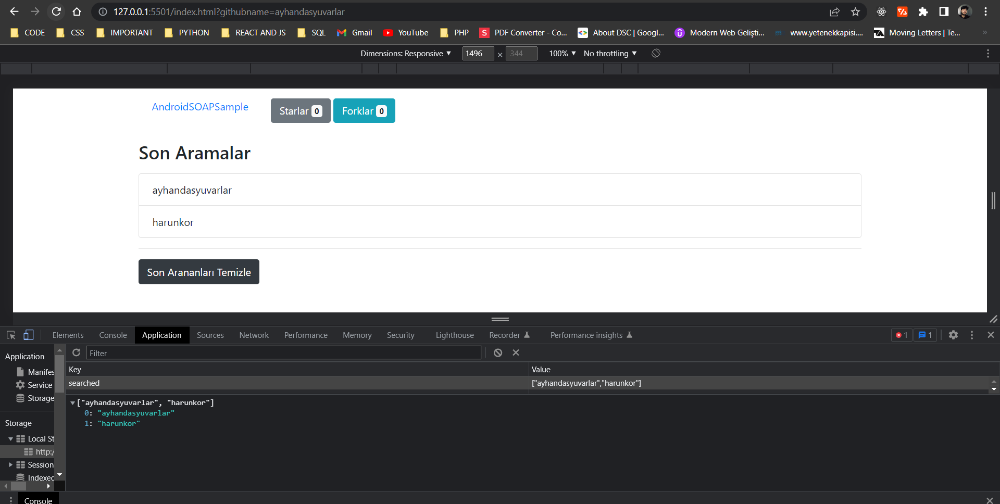

## Github Api Web App
Hi, I am Ayhan in this article and I have done this javascript githup api work. The application consists of 6 parts, querying the user, error message for the non-existent user, displaying the existing user and throwing the localstorage, showing the last searched in the localstorage in the interface and finally deleting the last searched from both the storage and the interface listed as process. In this application, I worked with fetch apis, asyn , await , static , class structures and the setTimeout function and I used it, it was an application that I enjoyed very much.

### App Images

